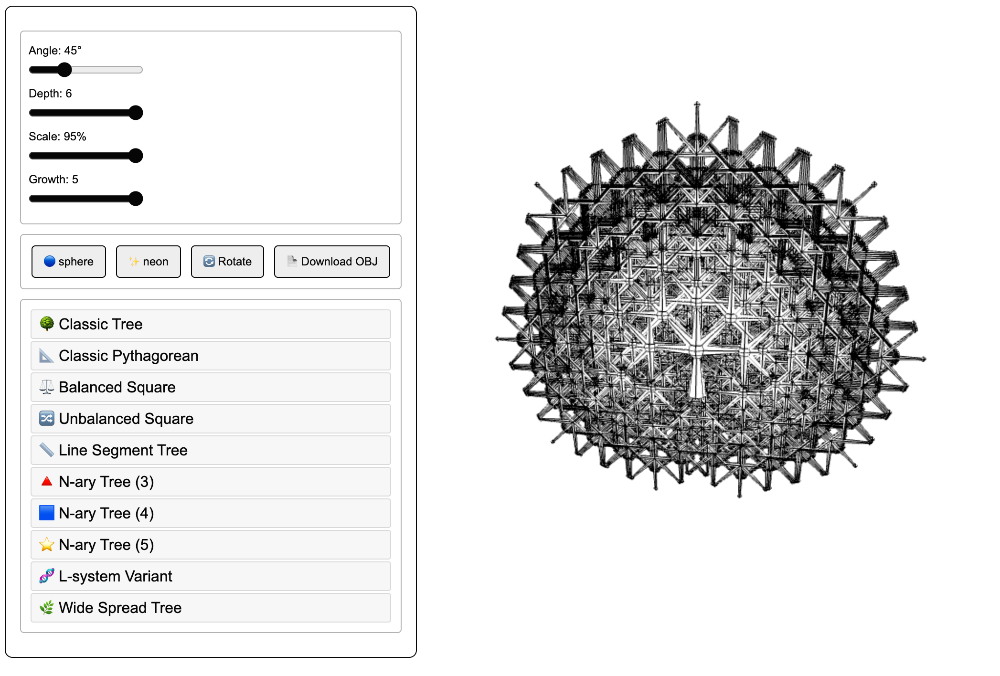

# Pythagorean Graph Engine

**UUON Foundation — Phillip Aguilar Ruiz III**
| [Live Engine](https://uuon-foundation.github.io/pythagorean-graph-engine/)

---

A Pythagorean tree is a fractal built from one rule: each branch splits into two smaller branches at a fixed angle, and each child is a scaled copy of its parent. Repeat that rule recursively and a complex structure grows from almost nothing. Five numbers (angle, depth, scale, growth rate, and node shape) are all it takes to generate thousands of connected geometries deterministically. Same five numbers, same structure, every time.



This engine renders that structure in 3D. It also exposes the deeper idea: the geometry is not the asset. The graph underneath it is.

---

## The Math

The Pythagorean tree is named for its connection to the Pythagorean theorem. In the classical construction, squares are drawn on the sides of a right triangle. The two smaller squares on the legs equal the area of the square on the hypotenuse. Repeat that construction recursively on each new square and a tree emerges.

This engine generalizes that construction into 3D space with variable branching. Instead of always splitting into two, a branch can split into two, three, four, or five children. The angle between them, the scale ratio at each generation, and the recursion depth are all adjustable in real time.

The result is not one structure. It is a family of structures, all derived from the same recursive rule, all regenerable from the same small parameter set.

---

## F = (P, E, R, C)

This formula describes what the engine does and why it matters beyond rendering.

```
F = (P, E, R, C)

P  Parameters     The seed: { angle, depth, scale, growth, mode }
E  Encoding       The full recursive topology generated from P
R  Representation Any output format: mesh, OBJ, STL, graph JSON, point cloud
C  Compression    The ratio of R size to P size
```

Five integers produce tens of thousands of vertices. That ratio — C — is not a trick. It is a structural property of recursion. At depth 6 with growth 3, C exceeds 50,000:1.

The practical consequence: any system that needs this geometry — a device, an AI agent, a simulation — can store P instead of R. P is 40 bytes. R is megabytes. Given P and this engine, any system reconstructs the identical geometry independently, without transmission.

[View the F=(P,E,R,C) diagram](./docs/FPERC-diagram.svg)

---

## Biological Connection

This engine was not designed to model biology. The correspondence emerged from the math.

The branching rules implemented here match the rules the human lung uses to build its arterial tree. Murray's Law — the principle governing how blood vessel radius scales across branching generations — produces the same 75% scale ratio this engine uses by default. The angle range (45 to 60 degrees) matches the bifurcation angles that minimize vascular resistance in pulmonary tissue. The recursion terminates when branch radius drops below a threshold, exactly as capillary formation stops when vessel diameter reaches its physical limit.

The N-ary branching modes (growth = 3, 4, 5) correspond to Purkinje cell dendritic trees in the cerebellum — one of the most geometrically regular neural structures known. Purkinje cells branch in a near-planar fan, which is what this engine produces when viewed from the front.

The engine is deterministic. Biological vascular and neural branching is genetically constrained to be nearly deterministic. Botanical trees are not — they respond to light, wind, and competition. That is why this engine matches vascular and neural geometry more precisely than it matches plant geometry, despite being called a "tree."

---

## What You Can Build With This

The engine is a self-contained HTML file. No install, no server, no dependencies beyond a browser.

**Researchers** can use it to generate parameterized branching topologies for study, export them as OBJ meshes, and compare structural properties across parameter sets.

**Developers** can fork the engine and extend the graph serializer to export the node/edge structure as JSON, making the topology available to any downstream system (database, API, simulation, AI agent).

**Educators** can use it to demonstrate recursive construction, fractal geometry, Murray's Law, and the relationship between parameters and emergent structure in real time.

**AI and IoT engineers** can treat P as a compact geometry descriptor. Instead of storing or transmitting full meshes, systems store P and reconstruct on demand. This is the compression property the engine demonstrates concretely.

The graph serializer and API layer are not yet built. The schema and proposed endpoints are documented in `README_EXTENSION.md`. That is the defined next step.

---

## Run It

Open `pythagorean-tree-engine.html` in any browser. No build step. No server.

Controls: left-drag to orbit, scroll to zoom, right-drag to pan.

---

## Repository Structure

```
pythagorean-graph-engine/
├── pythagorean-tree-engine.html   self-contained 3D engine
├── README.md                      this file
├── README_EXTENSION.md            F=(P,E,R,C) API schema and endpoints
├── LICENSE                        USAL-1.0 — origin: Phillip Aguilar Ruiz III
├── NOTICE                         provenance record, third-party dependencies
├── .env.example                   environment variables for future API layer
├── .gitignore
├── docs/
│   ├── FPERC-diagram.svg          visual diagram of F=(P,E,R,C)
│   └── ACADEMIC-RECORD.md         timestamped academic reference document
├── .github/
│   └── workflows/
│       └── gitleaks.yml           secret scan CI
└── api/
    └── README.md                  API layer specification (unbuilt)
```

---

## License

USAL-1.0 — UUON Source Attribution License.
Origin author: Phillip Aguilar Ruiz III.
Attribution required on all derivatives. AI training use prohibited without written permission. Commercial use requires a separate agreement.

See `LICENSE` for full terms.

---

*UUON Foundation Inc. — Kassel, Germany*
# UUON Foundation
